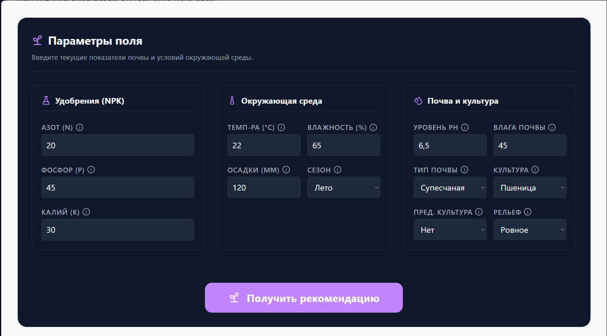
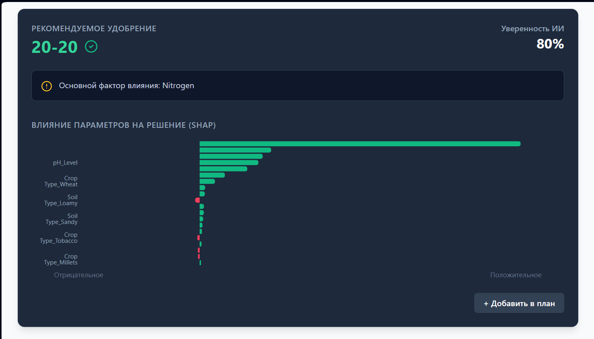

# 🌾 AgVend | Agronomy Decision Support

**AgVend** — это веб-приложение на базе машинного обучения (ML) для интеллектуального подбора оптимальных удобрений. Система анализирует характеристики почвы, климатические условия и особенности выращиваемой культуры, чтобы предоставить фермерам или агрономам обоснованные рекомендации.

Проект разработан в рамках курсовой работы.

---

## 🚀 Деплой приложения

**[🔗 Перейдите по ссылке, чтобы открыть рабочую версию приложения](#)**

---

## 📸 Скриншоты интерфейса

<div align="center">
  
  <br>
  
</div>

---

## ⚙️ Принцип работы

Система работает по принципу клиент-серверной архитектуры с интеграцией ML-модели:

1. **Сбор данных:** Пользователь вводит 14 параметров через удобный веб-интерфейс (уровни азота, фосфора, калия, температуру, влажность, pH, количество осадков, тип почвы, текущую и предыдущую культуру, особенности рельефа и сезон).
2. **Валидация:** Фронтенд проверяет введенные данные на корректность (с использованием Zod) и формирует POST-запрос.
3. **Обработка (Backend):** Django API принимает данные, сериализует их и передает в предварительно обученную модель машинного обучения (на основе табличных данных `extended_train.csv`).
4. **Инференс и SHAP-анализ:** Обученная модель генерирует предсказание (тип удобрения) и уверенность в нем. Одновременно SHAP (SHapley Additive exPlanations) вычисляет, как каждый из 14 признаков повлиял на итоговый ответ.
5. **Визуализация:** Результаты возвращаются на клиент и отображаются пользователю в виде понятных рекомендаций и графиков, описывающих логику принятия решения ИИ.

---

## 🛠 Технологический стек

**Фронтенд:**
* **React** + **TypeScript** 
* **Vite** — бандлер для быстрой сборки
* **Tailwind CSS** — оформление и адаптивная верстка
* **React Hook Form** + **Zod** — управление состояниями форм и валидация
* **Recharts** — визуализация графиков (для SHAP-значений)

**Бэкенд:**
* **Python 3**
* **Django** + **Django REST Framework (DRF)** — создание API
* **Scikit-learn** / **XGBoost** — машинное обучение
* **SHAP** — интерпретируемость моделей ИИ
* **Joblib** — сериализация и загрузка моделей (`ml_models/`)

---

## 📂 Структура проекта

Проект разделен на две основные директории: клиентскую и серверную части.

```text
web-interface/
├── agtech-app/                 # Фронтенд (React + Vite)
│   ├── public/                 # Статические файлы
│   ├── src/                    
│   │   ├── components/         # React-компоненты (PredictionForm, ResultView)
│   │   ├── hooks/              # Пользовательские хуки (API запросы)
│   │   ├── schema/             # Настройки валидации Zod (14 параметров)
│   │   ├── App.tsx             # Главный компонент, сборка макета
│   │   └── index.css           # Глобальные стили (Tailwind)
│   └── package.json            # Зависимости фронтенда
│
├── backend/                    # Бэкенд (Django + ML)
│   ├── agronomy/               
│   │   ├── ml_models/          # Сохраненные веса модели и препроцессоры (.joblib, .json)
│   │   ├── views.py            # Обработка API запросов
│   │   ├── serializers.py      # Валидация входных данных DRF
│   │   └── services.py         # Логика инференса ML-модели и генерация SHAP
│   ├── config/                 # Настройки Django
│   └── manage.py               # Утилита управления Django
│
└── extended_train.csv          # Исходный обучающий расширенный датасет
```

---

## 💻 Локальный запуск (Development)

### 1. Запуск Backend (Django)

Откройте терминал, перейдите в папку бэкенда и запустите сервер:
```bash
cd backend
# Активируйте виртуальное окружение (если используете)
python manage.py runserver
```
API будет доступно по адресу: `http://localhost:8000/`

### 2. Запуск Frontend (React)

Откройте второй терминал, перейдите в папку фронтенда, установите зависимости и запустите локальный сервер:
```bash
cd agtech-app
npm install
npm run dev
```
Приложение будет доступно по адресу: `http://localhost:5173/`

---

*Проект создан для демонстрации применения методов машинного обучения в сельском хозяйстве и веб-разработке.*
